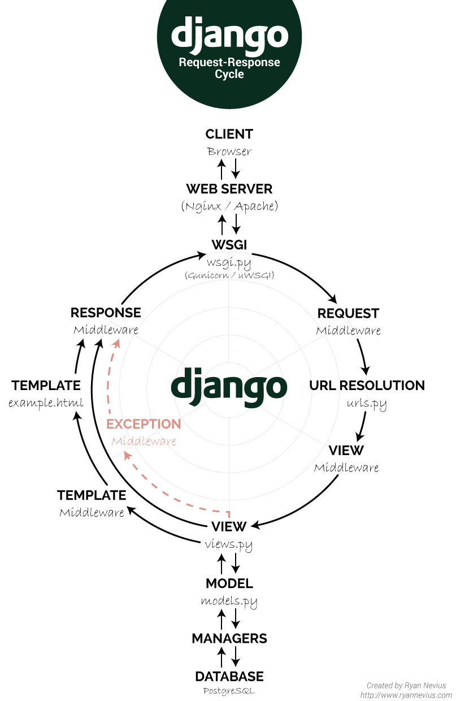

# Django 
Django is a high-level Python web framework that encourages rapid development and clean, pragmatic design. It is built by experienced developers and focuses on the principle of "don't repeat yourself" (DRY) to ensure efficient development and maintainability of web applications. Here's a brief overview of Django and its uses:

1. **Features:**
   - Django provides a rich set of features out of the box, including:
     - An ORM (Object-Relational Mapping) system for interacting with databases.
     - A powerful template system for generating HTML dynamically.
     - URL routing and request/response handling.
     - Form handling and validation.
     - Authentication and authorization.
     - Admin interface for managing application data.
     - Built-in security features to protect against common web vulnerabilities.
     - Internationalization and localization support.
     - Caching, middleware, and other utilities to enhance performance and functionality.

2. **Uses:**
   - Web Development: Django is primarily used for building web applications, ranging from simple websites to complex web platforms.
   - Content Management Systems (CMS): Many popular CMS platforms, such as Django CMS and Wagtail, are built on top of Django.
   - APIs: Django can be used to create RESTful APIs (Application Programming Interfaces) for serving data to client-side applications.
   - Data Analysis and Visualization: Django can be integrated with data analysis and visualization libraries like Pandas and Matplotlib for building data-driven web applications.
   - E-commerce: Django's flexibility and extensibility make it suitable for building e-commerce platforms and online marketplaces.
   - Social Networking: Django can power social networking sites, forums, and community platforms with features like user profiles, messaging, and activity feeds.
   - Business Applications: Django can be used to develop internal business applications such as CRMs (Customer Relationship Management) systems, project management tools, and inventory management systems.

3. **Benefits:**
   - Rapid Development: Django's built-in features and conventions streamline the development process, allowing developers to build web applications quickly.
   - Scalability: Django is designed to scale with the growth of your application, making it suitable for both small projects and large-scale deployments.
   - Security: Django provides built-in security features to help developers build secure web applications, including protection against common web vulnerabilities like SQL injection, XSS (Cross-Site Scripting), and CSRF (Cross-Site Request Forgery).
   - Community and Ecosystem: Django has a large and active community of developers, extensive documentation, and a rich ecosystem of third-party packages and extensions that extend its functionality.

Overall, Django is a versatile and powerful framework for building web applications of all sizes and complexities, providing developers with the tools and resources they need to create robust and maintainable software solutions.

## Creating project
To create a Django project, you need to follow these steps:

1. **Install Django:**
   If you haven't already installed Django, you can do so using pip, the Python package installer, by running the following command in your terminal or command prompt:
   ```
   pip install django
   ```

2. **Create a Django Project:**
   Once Django is installed, you can create a new Django project by running the following command:
   ```
   django-admin startproject project_name
   ```
   Replace `project_name` with the name you want to give your project.

3. **Navigate to the Project Directory:**
   After creating the project, navigate to the directory containing the project files:
   ```
   cd project_name
   ```

4. **Run the Development Server:**
   You can start the development server to run your Django project locally by executing the following command:
   ```
   python manage.py runserver
   ```
   This will start the server, and you should see output indicating that the server is running. By default, the server will run on `http://127.0.0.1:8000/` or `http://localhost:8000/`.

5. **Verify Installation:**
   Open a web browser and navigate to `http://127.0.0.1:8000/` or `http://localhost:8000/`. You should see the Django welcome page, confirming that your project has been successfully created and the development server is running.

6. **Create Django Apps (Optional):**
   Django projects are composed of one or more apps. You can create a new app within your project by running the following command:
   ```
   python manage.py startapp app_name
   ```
   Replace `app_name` with the name you want to give your app.

That's it! You've successfully created a new Django project. You can now start developing your web application by defining models, views, templates, and URLs according to your project requirements.

## Creating view and URL
To create a view and map it to a URL in a Django project, follow these steps:

1. **Create a View:**
   Create a new Python file inside your Django app directory (`views.py`) if it doesn't already exist. Then, define your view function.

   ```python
   # Inside views.py

   from django.http import HttpResponse

   def my_view(request):
       return HttpResponse("Hello, world!")
   ```

2. **Map View to URL:**
   Open the `urls.py` file in your app directory. If it doesn't exist, create it. Define a URL pattern that maps to your view function.

   ```python
   # Inside urls.py

   from django.urls import path
   from . import views

   urlpatterns = [
       path('hello/', views.my_view, name='hello'),
   ]
   ```

3. **Include App URLs in Project URLs:**
   If you haven't already done so, include your app's URLs in the project's main URL configuration (`urls.py` in the project directory).

   ```python
   # Inside project urls.py

   from django.contrib import admin
   from django.urls import path, include

   urlpatterns = [
       path('admin/', admin.site.urls),
       path('myapp/', include('myapp.urls')),  # Include app's URLs
   ]
   ```

4. **Test Your View:**
   Start the Django development server if it's not already running (`python manage.py runserver`) and navigate to the URL mapped to your view in a web browser (e.g., `http://127.0.0.1:8000/myapp/hello/`). You should see the response from your view function.

That's it! You've created a view and mapped it to a URL in your Django project. You can now continue building your application by defining more views, templates, models, and URLs as needed.



## Dynamic Path Segment and Captured values
In Django, you can capture dynamic values from URLs using path converters. Path converters allow you to define URL patterns with dynamic segments that match specific patterns in the URL path. Here's how you can use dynamic path segments and capture values from URLs:

1. **Define URL Patterns with Dynamic Segments:**
   Use angle brackets (`<>`) to define dynamic segments in your URL patterns. You can specify the name of the captured value and the converter type.

   ```python
   # Inside urls.py

   from django.urls import path
   from . import views

   urlpatterns = [
       path('articles/<int:year>/', views.year_archive),
       path('articles/<int:year>/<int:month>/', views.month_archive),
       path('articles/<int:year>/<int:month>/<slug:slug>/', views.article_detail),
   ]
   ```

2. **Capture Values in View Functions:**
   Define view functions that accept parameters matching the captured values defined in the URL patterns.

   ```python
   # Inside views.py

   from django.http import HttpResponse

   def year_archive(request, year):
       return HttpResponse(f"You're viewing the archive for the year {year}.")

   def month_archive(request, year, month):
       return HttpResponse(f"You're viewing the archive for {month}/{year}.")

   def article_detail(request, year, month, slug):
       return HttpResponse(f"You're viewing the article {slug} published in {month}/{year}.")
   ```

3. **Access Captured Values:**
   Inside the view functions, you can access the captured values as function parameters.

   - `year` in `year_archive`
   - `year` and `month` in `month_archive`
   - `year`, `month`, and `slug` in `article_detail`

4. **Test Your URLs:**
   Start the Django development server (`python manage.py runserver`) and navigate to URLs matching the defined patterns. For example:
   - `/articles/2022/`
   - `/articles/2022/01/`
   - `/articles/2022/01/my-article-slug/`

By using dynamic path segments and capturing values from URLs, you can create flexible URL patterns that adapt to different data contexts and build more dynamic web applications in Django.

## Path Convertors
In Django, path converters are used to capture and convert parts of a URL path into Python objects, which can then be passed as parameters to view functions. Django provides several built-in path converters to match common types of data in URLs. Here are some commonly used path converters:

1. **int:**
   - Matches an integer value in the URL path.
   - Example: `path('<int:pk>/', views.detail_view)`

2. **str:**
   - Matches any non-empty string, excluding the path separator (`/`).
   - Example: `path('category/<str:category_slug>/', views.category_view)`

3. **slug:**
   - Matches a slug, typically used for human-readable URLs with lowercase letters, numbers, and hyphens.
   - Example: `path('post/<slug:post_slug>/', views.post_detail)`

4. **uuid:**
   - Matches a Universally Unique Identifier (UUID) in the URL path.
   - Example: `path('user/<uuid:user_id>/', views.user_profile)`

5. **path:**
   - Matches any string, including the path separator (`/`).
   - Useful for capturing entire URL paths or file paths.
   - Example: `path('file/<path:file_path>/', views.file_download)`

6. **str_list:**
   - Matches a list of strings separated by slashes (`/`).
   - Example: `path('tags/<str_list:tag_list>/', views.tag_search)`

7. **date:**
   - Matches a date object in the URL path. Requires a specific date format (YYYY-MM-DD).
   - Example: `path('events/<date:date>/', views.event_detail)`

8. **datetime:**
   - Matches a datetime object in the URL path. Requires a specific datetime format.
   - Example: `path('event/<datetime:event_datetime>/', views.event_detail)`

You can use these path converters in your URL patterns by specifying them within angle brackets (`< >`) followed by the converter name. When a URL matches a pattern with a path converter, Django will convert the corresponding part of the URL into the specified Python object type and pass it as a parameter to the associated view function.

For more information on path converters and their usage, you can refer to the Django documentation: [URL dispatcher](https://docs.djangoproject.com/en/stable/topics/http/urls/#path-converters)

## Reverse Function and Named URLS

In Django, the `reverse()` function and named URLs provide a convenient way to generate URLs for views without hardcoding them in your templates or views. Named URLs allow you to assign unique names to specific URL patterns, making it easier to reference them throughout your Django project. Here's how you can use the `reverse()` function and named URLs:

1. **Defining Named URLs:**
   In your `urls.py` file, you can assign names to your URL patterns using the `name` argument.

   ```python
   # Inside urls.py

   from django.urls import path
   from . import views

   urlpatterns = [
       path('home/', views.home, name='home'),
       path('blog/', views.blog, name='blog'),
       path('blog/<int:post_id>/', views.post_detail, name='post_detail'),
   ]
   ```

2. **Using Reverse in Views:**
   You can use the `reverse()` function in your views to dynamically generate URLs based on the named URLs you've defined.

   ```python
   # Inside views.py

   from django.urls import reverse
   from django.http import HttpResponseRedirect

   def my_view(request):
       # Redirect to the home page using the named URL 'home'
       return HttpResponseRedirect(reverse('home'))
   ```

3. **Using Reverse in Templates:**
   In your templates, you can use the `` template tag to generate URLs based on the named URLs defined in your `urls.py`.

   ```html
   <!-- Inside a template -->
   <a href="">Blog</a>
   ```

4. **Passing Arguments with Reverse:**
   If your URL pattern expects arguments, you can pass them as arguments to the `reverse()` function.

   ```python
   # Inside views.py

   from django.urls import reverse
   from django.http import HttpResponseRedirect

   def redirect_to_post(request, post_id):
       # Redirect to the post detail page using the named URL 'post_detail' with the post_id argument
       return HttpResponseRedirect(reverse('post_detail', args=[post_id]))
   ```

By using the `reverse()` function and named URLs in Django, you can ensure that your URLs are more maintainable, flexible, and less error-prone, as they are dynamically generated based on the assigned names rather than hardcoded strings.

## URLS, Views and Dynamic view logic
In Django, URL patterns and views work together to handle incoming requests and determine how to respond to them. Dynamic view logic allows you to create flexible views that can handle different scenarios based on user input, database queries, or other factors. Here's how you can combine URLs, views, and dynamic view logic in Django:

1. **Define URL Patterns:**
   In your Django project's `urls.py` file, define URL patterns using the `path()` function or `re_path()` function (for regular expressions).

   ```python
   # Inside urls.py

   from django.urls import path
   from . import views

   urlpatterns = [
       path('articles/', views.article_list, name='article_list'),
       path('articles/<int:article_id>/', views.article_detail, name='article_detail'),
   ]
   ```

2. **Create Views:**
   Define view functions in your `views.py` file. Views are Python functions or classes that take a request as input and return an HTTP response.

   ```python
   # Inside views.py

   from django.shortcuts import render
   from django.http import HttpResponse
   from .models import Article

   def article_list(request):
       articles = Article.objects.all()
       return render(request, 'articles/article_list.html', {'articles': articles})

   def article_detail(request, article_id):
       article = Article.objects.get(id=article_id)
       return render(request, 'articles/article_detail.html', {'article': article})
   ```

3. **Dynamic View Logic:**
   Your view functions can contain dynamic logic based on the incoming request, URL parameters, database queries, user authentication, and other factors.

   ```python
   # Inside views.py

   from django.shortcuts import render
   from django.http import HttpResponse
   from .models import Article

   def article_detail(request, article_id):
       try:
           article = Article.objects.get(id=article_id)
       except Article.DoesNotExist:
           return HttpResponse("Article not found", status=404)
       return render(request, 'articles/article_detail.html', {'article': article})
   ```

   In this example, we handle the case where the requested article does not exist by returning a 404 HTTP response.

4. **Render Templates:**
   Use the `render()` function to render HTML templates with dynamic data passed from the view.

5. **URL Parameters:**
   URL parameters specified in the URL pattern (e.g., `<int:article_id>`) are passed as arguments to the view function.

6. **Handling Different HTTP Methods:**
   You can handle different HTTP methods (GET, POST, etc.) in your view functions using conditional statements or Django's built-in decorators (`@require_GET`, `@require_POST`, etc.).

By combining URL patterns, views, and dynamic view logic, you can create powerful and flexible web applications in Django that respond to user requests and provide dynamic content based on various factors.

## Adding and regestring Templates
To add and register templates in Django, you need to follow these steps:

1. **Create a Templates Directory:**
   First, create a directory to store your HTML templates. By convention, this directory is often named `templates` and is located within each Django app's directory.

   ```
   myapp/
   ├── templates/
   │   └── myapp/
   │       └── index.html
   ├── __init__.py
   ├── admin.py
   ├── apps.py
   ├── models.py
   ├── tests.py
   └── views.py
   ```

2. **Create HTML Templates:**
   Inside the templates directory, create HTML files for your templates. These files will contain the structure and content of your web pages. For example, you might have an `index.html` file for the homepage of your app.

   ```html
   <!-- Inside index.html -->
   <!DOCTYPE html>
   <html lang="en">
   <head>
       <meta charset="UTF-8">
       <meta name="viewport" content="width=device-width, initial-scale=1.0">
       <title>My App</title>
   </head>
   <body>
       <h1>Welcome to My App</h1>
       <!-- Your content here -->
   </body>
   </html>
   ```

3. **Register the Templates Directory:**
   Django needs to know where to look for templates. You need to specify the directory containing your templates in the `TEMPLATES` setting in your project's settings file (`settings.py`).

   ```python
   # Inside settings.py

   TEMPLATES = [
       {
           'BACKEND': 'django.template.backends.django.DjangoTemplates',
           'DIRS': [os.path.join(BASE_DIR, 'templates')],  # Add this line
           'APP_DIRS': True,
           'OPTIONS': {
               # Other options...
           },
       },
   ]
   ```

   Ensure that `'APP_DIRS': True` is set, as it allows Django to look for templates within the `templates` directories of installed apps as well.

4. **Rendering Templates in Views:**
   Finally, render the HTML templates in your views using the `render()` function from `django.shortcuts`.

   ```python
   # Inside views.py

   from django.shortcuts import render

   def index(request):
       return render(request, 'myapp/index.html')
   ```

   This code renders the `index.html` template located in the `myapp` directory within the `templates` directory.

By following these steps, you can add and register templates in your Django project, allowing you to organize your HTML files and render them dynamically within your views.

## DTL- Django Template Language
The Django Template Language (DTL) is a markup language used in Django templates to generate dynamic HTML content. DTL allows you to insert Python-like logic directly into your HTML templates, enabling you to generate dynamic content based on data from your Django views and models. Here are some key features of DTL:

1. **Variable Output:**
   You can output the value of variables in your templates using double curly braces (`{{ variable }}`). For example:

   ```html
   <p>Hello, {{ user.username }}!</p>
   ```

2. **Template Tags:**
   Django provides built-in template tags to perform various operations within templates. Template tags are enclosed in curly braces with percent signs (``). For example:

   - ``: Conditional statements
   - ``: Looping over lists
   - ``: Generating URLs
   - `` and ``: Template inheritance

3. **Template Filters:**
   Template filters modify the output of variables or template tags. Filters are applied using a pipe character (`|`). For example:

   ```html
   <p>{{ text|upper }}</p>  <!-- Convert text to uppercase -->
   ```

4. **Comments:**
   You can add comments in your templates using `{# #}`. Comments are ignored by the template engine and are useful for documenting your templates.

   ```html
   {# This is a comment #}
   ```

5. **Template Inheritance:**
   DTL supports template inheritance, allowing you to create a base template with common elements and extend it in other templates. You can define blocks in the base template that child templates can override.

   ```html
   <!-- base.html -->
   <html>
   <head>
       <title>My Site</title>
   </head>
   <body>
       
   </body>
   </html>
   ```

   ```html
   <!-- child.html -->
   

   My Custom Title

   
   <h1>Hello, World!</h1>
   
   ```

6. **Loading Tags and Filters:**
   You can load custom template tags and filters using the `` tag. This allows you to use custom template tags and filters in your templates.

   ```html
   
   <p>{{ value|custom_filter }}</p>
   ```

Overall, DTL provides a powerful and flexible way to create dynamic HTML content in Django templates, allowing you to build sophisticated web applications with ease.

## Tags
In Django Template Language (DTL), template tags are special constructs that allow you to perform various operations and logic directly within your HTML templates. Tags are enclosed within `` and provide a way to add dynamic behavior to your templates. Django comes with a variety of built-in template tags that cover common use cases. Here are some commonly used template tags:

1. **Control Flow Tags:**
   - ``: Conditional statement to execute code based on a condition.
   - ``: Looping construct to iterate over elements in a list or queryset.
   - ``: Assigns a value to a variable for use within a specific block of template code.
   - `` and ``: Used for template inheritance, allowing you to define reusable base templates and override specific blocks in child templates.

2. **URL Tags:**
   - ``: Generates a URL for a given view and optional parameters.
   - ``: Generates a URL for a static file (e.g., CSS, JavaScript) in your project's `STATIC_URL` setting.

3. **Template Inclusion Tags:**
   - ``: Includes the contents of another template within the current template.

4. **Block Tags:**
   - ``: Defines a block in a template that can be overridden by child templates when using template inheritance.

5. **Variable Assignment Tags:**
   - ``: Assigns a value to a variable for use within a specific block of template code.

6. **CSRF Token Tag:**
   - ``: Inserts a CSRF (Cross-Site Request Forgery) token into the form to prevent CSRF attacks.

7. **Comment Tags:**
   - `{# #}`: Allows you to add comments within your templates that are ignored by the template engine.

8. **Loading Tags and Filters:**
   - ``: Loads custom template tags and filters for use within the template.

These are just a few examples of Django's built-in template tags. Additionally, you can create your own custom template tags by writing Python code in a separate module and registering them with Django.

Template tags are a powerful feature of Django templates, allowing you to add logic and dynamic behavior to your HTML templates without mixing presentation logic with your Python code. They help you keep your code clean, modular, and easy to maintain.

##  Template inheritance
Template inheritance in Django allows you to create a base template that defines the overall structure of your site, and then extend or override specific sections of that template in child templates. This promotes code reuse and maintainability by reducing duplication of common elements across multiple pages. Here's how it works:

1. **Base Template:** 
   - Create a base template that contains the common elements shared across multiple pages, such as headers, footers, navigation menus, and other static content.
   - Use the `` tag to define sections within the base template that can be overridden by child templates.

Example of a base template (`base.html`):
```html
<!DOCTYPE html>
<html lang="en">
<head>
    <meta charset="UTF-8">
    <title>My Site</title>
</head>
<body>
    <header>
        <!-- Header content -->
    </header>
    
    <nav>
        <!-- Navigation menu -->
    </nav>
    
    <main>
        
        
    </main>
    
    <footer>
        <!-- Footer content -->
    </footer>
</body>
</html>
```

2. **Child Templates:**
   - Create child templates that extend the base template and override specific sections using the `` and `` tags.
   - Use the same block names defined in the base template to override those sections in the child template.

Example of a child template (`child.html`):
```html



    Child Page - My Site



    <h1>Welcome to the Child Page</h1>
    <p>This is the content of the child page.</p>

```

In this example:
- The `` tag specifies that `child.html` extends `base.html`, inheriting its structure and content.
- The `` tag overrides the title section defined in the base template.
- The `` tag overrides the content section defined in the base template with specific content for the child template.

When a view renders the `child.html` template, Django combines the base template and child template, replacing the overridden sections from the child template into the corresponding blocks in the base template. This results in a complete HTML page with the structure and content defined in both the base and child templates.

## Static files
In Django, static files are files such as CSS, JavaScript, images, and other assets that are served directly to the client without being processed by the Django server. Here's how you work with static files in Django:

1. **Static Files Directory:**
   - Create a directory in your app called `static` to store your static files. You can also have subdirectories within the `static` directory to organize your files.

2. **Settings Configuration:**
   - Make sure your `STATICFILES_DIRS` setting in your Django settings file (`settings.py`) includes the directories where your static files are located. By default, Django includes the `static` directory in each app, but you can specify additional directories if needed.

   ```python
   STATICFILES_DIRS = [
       os.path.join(BASE_DIR, 'static'),
   ]
   ```

3. **Collecting Static Files:**
   - During deployment, you typically collect all your static files into a single location using the `collectstatic` management command. This command copies all the static files from your apps' `static` directories to a single directory defined by the `STATIC_ROOT` setting.

   ```bash
   python manage.py collectstatic
   ```

4. **Linking Static Files in Templates:**
   - Use the `` template tag to link to your static files in your HTML templates. This tag generates the URL to the static file by appending the file's path relative to the `STATICFILES_DIRS`.

   ```html
   <link rel="stylesheet" type="text/css" href="">
   ```

5. **Serving Static Files During Development:**
   - During development, Django's built-in development server automatically serves static files from the `static` directories of your apps. You don't need to do anything special to serve static files during development.

6. **Serving Static Files in Production:**
   - In production, you need to configure your web server (e.g., Nginx or Apache) to serve static files from the directory specified by `STATIC_ROOT`. Django doesn't serve static files in production for performance and security reasons.

By following these steps, you can effectively manage and serve static files in your Django project, ensuring that your web pages have the necessary CSS, JavaScript, and other assets to render properly in the browser.